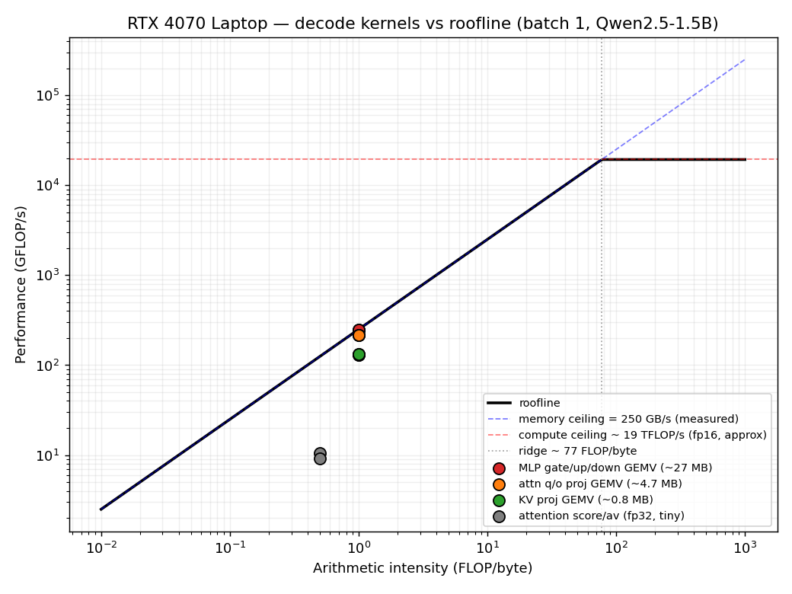
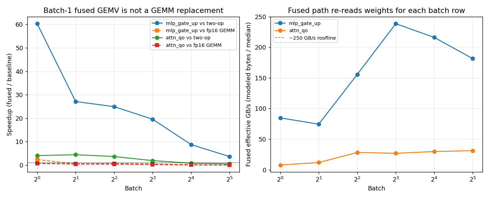

<h1 align="center">Decode Roofline</h1>

<p align="center">
  <b>Attributing and optimizing LLM decode at the CUDA-kernel level on an RTX 4070 Laptop GPU.</b>
</p>

<p align="center">
  <a href="docs/01_roofline.md"></a>
  <a href="docs/02_kernel_design.md"></a>
  <a href="docs/00_environment.md"></a>
  <a href="kernels/tests/test_correctness.py"></a>
  <a href="bench/results/sweep.csv"></a>
</p>

<p align="center">
  <a href="#tldr"><b>TL;DR</b></a> ·
  <a href="#key-results"><b>Key Results</b></a> ·
  <a href="#method"><b>Method</b></a> ·
  <a href="#reproduce"><b>Reproduce</b></a> ·
  <a href="#project-structure"><b>Project Structure</b></a>
</p>

---

## TL;DR

> On an **RTX 4070 Laptop GPU** (Ada AD106, 8 GB, ~250 GB/s measured DRAM ceiling), batch-1 LLM decode is dominated by **weight-streaming GEMVs**. Nsight shows **~81% of decode GPU-kernel time** in cuBLAS GEMV kernels, with the largest MLP projections running at **~95% of the memory roofline**. A custom **fused INT4 dequant + GEMV** kernel moves ~8.7× fewer bytes than a literal two-op dequant baseline and reaches **~223 GB/s** in `ncu`, but the win is honestly regime-specific: it is a **batch-1 large-GEMV primitive**, not a batched GEMM replacement.

---

## Overview

Decode-phase inference at batch size 1 turns transformer linear layers into matrix-vector products. On a mobile RTX 4070, those GEMVs are not limited by FLOPs; they are limited by how fast weights can be streamed from DRAM.

This project asks a narrow systems question:

> Can we attribute decode cost to individual CUDA kernels, prove the dominant kernels are memory-bound, and then reduce bytes moved with a fused dequantization kernel?

The answer is yes, with important caveats. The implementation follows four checkpoints:

1. **CUDA ramp:** prove custom ops compile, run, and profile on Windows.
2. **Measurement:** build a 4070 Laptop roofline from Nsight data.
3. **Kernel:** implement a correctness-gated fused INT4 dequant + GEMV.
4. **Attribution:** sweep regimes and show where the speedup holds and disappears.

---

## Related Work
### Why a from-scratch kernel? 
Production INT4 kernels such as Marlin, AWQ, and bitsandbytes are NOT the baseline this project is trying to beat. 
1. Marlin is a mixed-precision GEMM kernel explicitly tuned for medium batch sizes (~16–32 tokens) on datacenter GPUs, designed to push weight-only quantization past the batch-1 regime.
2. AWQ is primarily an activation-aware quantization method with serving-oriented kernels.
3. bitsandbytes provides general 4/8-bit kernels optimized for compatibility and QLoRA rather than decode latency. 

This project targets the opposite corner: batch-1, weight-streaming GEMV on a consumer mobile GPU, where the goal is to attribute decode cost at the kernel level and prove memory-boundedness (not to ship a production kernel). A black-box library would obscure the per-kernel attribution this project is about, and the result (the fused kernel wins only at B=1, then cedes to FP16 GEMM) fits perfectly in the regime Marlin is built to leave behind.

## Key Results

|  |  |
| --- | --- |
| **Roofline placement.** Batch-1 decode GEMVs sit on the memory ceiling at arithmetic intensity ~1 FLOP/byte. | **Regime sweep.** The fused kernel wins in batch-1 large-GEMV mode, then loses to GEMM-style reuse as batch grows. |

### Headline Numbers

| Result | Value |
| --- | --- |
| Target model / workload | Qwen2.5-1.5B, FP16, batch-1 decode |
| Hardware | RTX 4070 Laptop GPU, 8 GB, Ada AD106, 36 SMs |
| Measured DRAM ceiling | **~250 GB/s achievable** (`ncu` theoretical peak ~259 GB/s) |
| Decode bottleneck | **~81% of GPU-kernel time** in weight GEMVs |
| Dominant baseline GEMV | MLP gate/up/down: ~27.5 MB read, ~112 us, **~247 GB/s** |
| Fused kernel | INT4 group dequant + GEMV, `G=128`, FP32 accumulation |
| Fused `ncu` result | **~223 GB/s**, 86.38% of hardware peak, correctness checked before launch |
| Phase 2 speedup | **90.8×** vs literal PyTorch two-op dequant -> GEMV baseline |
| Honest caveat | vs FP16 GEMM, fused MLP wins only at **B=1** (2.38×) and loses by **B=2** |

### What Actually Happens

| Regime | Outcome | Interpretation |
| --- | --- | --- |
| Batch 1, large MLP projection | Fused wins; byte reduction matters | Pure weight streaming, memory-bound |
| Batch 1, smaller attention q/o projection | Fused does not beat FP16 GEMM | Too small to saturate the roofline; launch/per-row overhead matters |
| Batch > 1 | Fused loses to FP16 GEMM | Weight reuse raises arithmetic intensity; GEMM is the right primitive |
| Literal two-op dequant baseline | Fused remains faster, but speedup shrinks | Baseline dequantizes once; fused rereads packed weights per batch row |

---

## Method

### 1. Measure the Machine, Not the Datasheet

Environment details are recorded in [`docs/00_environment.md`](docs/00_environment.md):

- RTX 4070 **Laptop** GPU, 8 GB GDDR6, CC 8.9, 36 SMs
- Driver 581.95, CUDA toolkit 13.2, PyTorch 2.6.0+cu124
- Nsight Compute 2026.1.1, Nsight Systems 2025.6.3
- Measured bandwidth ceiling: **~250 GB/s achievable**

The roofline uses measured bandwidth, not the nominal 256 GB/s datasheet figure.

### 2. Attribute Decode with Nsight

The native batch-1 decode loop in [`profiling/nsys_decode.py`](profiling/nsys_decode.py) profiles Qwen2.5-1.5B on the same Windows/CUDA environment used by the custom kernel.

Nsight Systems identifies cuBLAS `gemvx` as the dominant CUDA-kernel class. Nsight Compute then measures per-kernel bandwidth, SM throughput, L2 hit rate, and occupancy.

### 3. Fuse Dequantization into GEMV

The fused kernel in [`kernels/dequant_gemv.cu`](kernels/dequant_gemv.cu) uses a simple symmetric INT4 group format:

```text
scale = max(abs(W_group)) / 7
q     = clamp(round(W / scale), -7, 7)
nib   = q + 8
w_hat = (nib - 8) * scale
```

Packing is 8 nibbles per `int32`; scales are FP16 per row/group; accumulation is FP32. The Phase 2 design and traffic arithmetic are in [`docs/02_kernel_design.md`](docs/02_kernel_design.md).

### 4. Correctness Gates Every Number

No timing is reported unless a correctness check passes in the same run:

- `kernels/tests/test_correctness.py` validates multiple Qwen-shaped projections and seeds.
- `kernels/tests/test_bench.py` correctness-checks before writing `bench/results/bench.csv`.
- `bench/profile_dequant_gemv.py` correctness-checks before the `ncu` profiled launch.
- `bench/sweep.py` correctness-checks every row before timing.

---

## Reproduce

### Quick Setup

```bash
# CUDA-enabled torch first, then the rest
pip install torch==2.6.0 --index-url https://download.pytorch.org/whl/cu124
pip install -r requirements.txt

# should print ENVIRONMENT: GREEN
python scripts/check_env.py
```

On native Windows, custom CUDA extensions require MSVC as the host compiler. The repo includes [`scripts/with_msvc.bat`](scripts/with_msvc.bat), which activates VS2022 Build Tools before running `nvcc`/`ncu` workflows.

### One-Command Reproduction

```bash
bash scripts/reproduce.sh
```

This regenerates:

- `bench/results/bandwidth.csv`
- `bench/results/ncu_gemv.csv`
- `bench/results/ncu_kernels.csv`
- `bench/results/roofline.png`
- `bench/results/bench.csv`
- `bench/results/ncu_fused.csv`
- `bench/results/sweep.csv`
- `bench/results/sweep.png`

### Useful Individual Commands

```bash
# build the fused CUDA extension
MSYS_NO_PATHCONV=1 cmd.exe /c "scripts\with_msvc.bat python kernels/load.py"

# correctness only
MSYS_NO_PATHCONV=1 cmd.exe /c "scripts\with_msvc.bat python -m pytest kernels\tests\test_correctness.py -v"

# correctness-gated benchmark
MSYS_NO_PATHCONV=1 cmd.exe /c "scripts\with_msvc.bat python -m pytest kernels\tests\test_bench.py -v -s"

# regime sweep
MSYS_NO_PATHCONV=1 cmd.exe /c "scripts\with_msvc.bat python bench\sweep.py"
```

If `make` is installed, the same workflows are exposed as `make env`, `make build`, `make test`, `make profile-ncu`, `make roofline`, `make bench`, `make sweep`, and `make reproduce`.

---

## Results Guide

| File | What it contains |
| --- | --- |
| [`docs/00_environment.md`](docs/00_environment.md) | Exact hardware/software, Nsight counter permissions, Windows build recipe |
| [`docs/01_roofline.md`](docs/01_roofline.md) | Decode-kernel roofline analysis and memory-bound conclusion |
| [`docs/02_kernel_design.md`](docs/02_kernel_design.md) | INT4 format, traffic math, fused-kernel `ncu` result |
| [`docs/03_results.md`](docs/03_results.md) | Batch/shape sweep and honest attribution |
| [`bench/results/`](bench/results) | Checked-in CSVs and plots so the README renders without a GPU |

---

## Project Structure

<details>
<summary><b>Click to expand</b></summary>

```text
decode-roofline/
├── README.md
├── PROJECT_SPEC.md
├── requirements.txt
├── environment.yml
├── Makefile
│
├── docs/
│   ├── 00_environment.md
│   ├── 01_roofline.md
│   ├── 02_kernel_design.md
│   └── 03_results.md
│
├── profiling/
│   ├── measure_bandwidth.py
│   ├── nsys_decode.py
│   ├── ncu_kernels.py
│   ├── roofline.py
│   └── metrics.md
│
├── harness/
│   ├── load_model.py
│   ├── reference_gemv.py
│   └── decode_harness.py
│
├── kernels/
│   ├── dequant_gemv.cu
│   ├── dequant_gemv_bindings.cpp
│   ├── load.py
│   └── tests/
│       ├── test_correctness.py
│       └── test_bench.py
│
├── bench/
│   ├── profile_dequant_gemv.py
│   ├── sweep.py
│   └── results/
│       ├── roofline.png
│       ├── sweep.png
│       └── *.csv
│
└── scripts/
    ├── check_env.py
    ├── phase0_saxpy.py
    ├── reproduce.sh
    └── with_msvc.bat
```

</details>

---

## Engineering Rules

- **Correctness before speed.** Every benchmark and profiler launch is gated by a reference check.
- **No speedup without profiler context.** Headline claims include shape, regime, achieved bandwidth, and roofline placement.
- **Median + IQR, not best-case.** The target is a mobile GPU; thermal and Windows jitter are part of the measurement.
- **Measured roofline only.** The project uses measured bandwidth from this machine, not desktop 4070 numbers.
- **Small, verified results beat large, speculative ones.** The final claim is intentionally regime-aware.

---

## Citation

If you find this useful, cite the repository:

```bibtex
@misc{more2026decoderoofline,
  title  = {Decode Roofline: Kernel-Level Decode Profiling and Fused Dequant-GEMV on an RTX 4070 Laptop GPU},
  author = {More, Rishi},
  year   = {2026},
  url    = {https://github.com/rishi-more-2003/decode-roofline}
}
```

---

Built as a from-scratch CUDA/systems research project on consumer mobile silicon.
